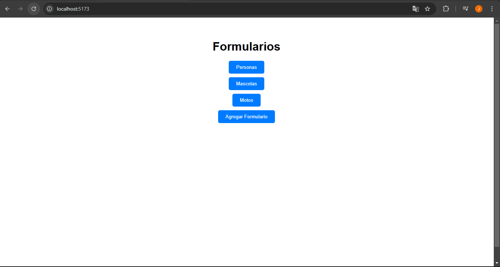
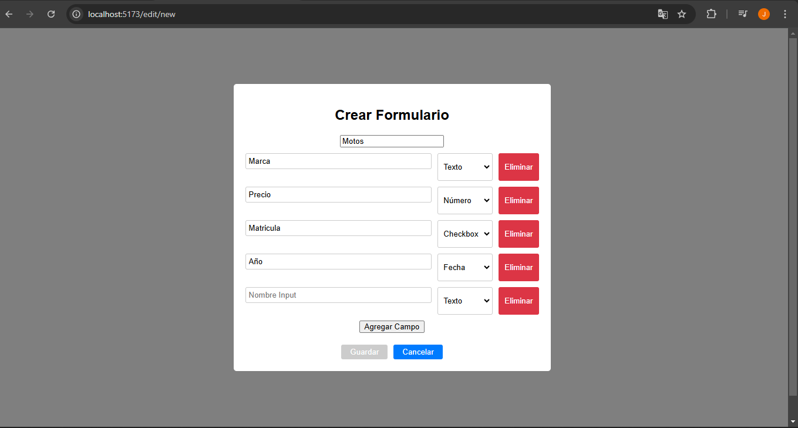
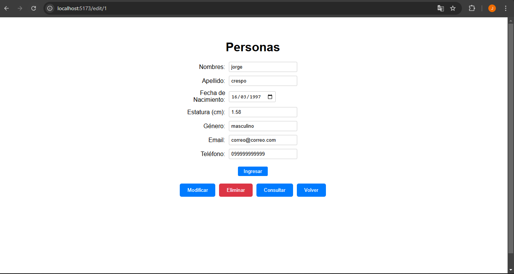
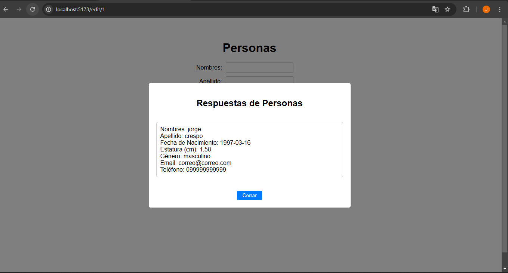

# Prueba Técnica Fullstack .NET y React

Aplicativo web para gestionar formularios dinámicos con ingreso y consulta de respuestas.

## Requisitos

- .NET 9 SDK
- SQL Server 2019 (localhost, autenticación Windows)
- Node.js 18+ y npm

## Ejecución del Backend

1. cd BackEnd/DynamicFormApi
2. dotnet run

- Corre en https://localhost:7201
- Crea automáticamente la base `DynamicFormDb` con datos iniciales ("Personas", "Mascotas")

### Base de Datos Manual (Opcional)

- Ejecuta `database.sql` en SSMS si prefieres crear `DynamicFormDb` manualmente.

## Ejecución del Frontend

1. cd FrontEnd/DynamicFormApp
2. npm install
3. npm run dev

- Corre en http://localhost:5173

## Evidencias

1. Listado: 
2. Creación: 
3. Edición: 
4. Ingreso: 
5. Consulta: 
